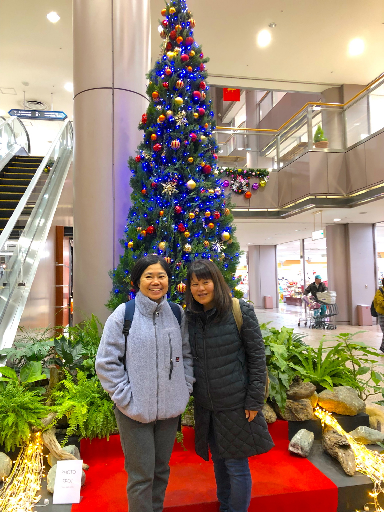

# utsunomiya
<html lang="ja">
 <head>
  <meta charset="utf-8" />
	 

<link href="https://cdnjs.cloudflare.com/ajax/libs/lightbox2/2.7.1/css/lightbox.css" rel="stylesheet">
 
</head>
<body>
<h1><marquee behavior="alternate">!!! 2561年12月24日(月) Utsunimiya!!!</marquee></h1>

<marquee direction="right" scrollamount="20" width="30%">(^_^)/~hada</marquee>

                             

<h3>↓ 画像はクリックで拡大します。スライドショーで閲覧できます。</h3>

  <!--

-->

  
<main>

</main>
                  	
	
	

              

<!-- フッタ -->
 <footer>
 Copyright 2018/12/24 S.Hada
	</footer>
